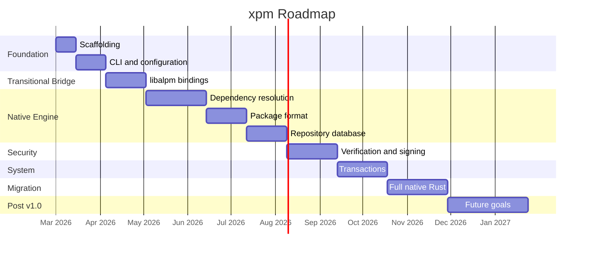

# Roadmap — xpm Package Manager

> Rust-based package manager for the 'X' distribution (Arch Linux-based).

## Current Status

Phases 0–1 mostly complete — project scaffolding, CLI with 8 subcommands,
and TOML configuration parser are implemented and tested.

---

## Phase 0 · Project Scaffolding <!-- phase:phase-0:scaffolding -->

- [x] Initialize Rust crate with cargo init (#1)
- [x] Configure Cargo workspace — multi-crate (#2)
- [x] Add linter and formatter configuration (#3)
- [ ] Set up CI pipeline (#4)
- [x] Add license and crate metadata (#5)
- [ ] Update README to reflect current architecture and repo strategy

## Phase 1 · CLI and Configuration <!-- phase:phase-1:cli -->

- [x] Implement CLI interface with clap (#6)
- [x] Implement configuration parser (#7)
- [x] Implement main.rs orchestration (#8)
- [x] Integrate lib.rs with CLI (#9)
- [ ] Define activation commands and parameter matrix — document all CLI invocations, flags and aliases (#46)
- [ ] Define fetch targets — repositories, mirrors and sync endpoints (#47)
- [ ] Implement repo subcommand — xpm repo add, remove, list
- [ ] Implement temporary repo file — /etc/xpm.d/ directory for user-added repos
- [ ] Set predefined default repo in config — GitHub Pages x-repo as built-in

## Phase 2 · FFI Bindings with libalpm — Transitional Bridge <!-- phase:phase-2:ffi-bridge -->

- [ ] Integrate alpm.rs crate (#10)
- [ ] Create Rust wrapper over ALPM operations (#11)
- [ ] Integration tests with local repository (#12)

## Phase 3 · Native Dependency Resolution Engine <!-- phase:phase-3:resolver -->

- [ ] Integrate resolvo SAT solver (#13)
- [ ] Implement dependency-to-CNF clause translator (#14)
- [ ] Implement Unit Propagation with watched literals (#15)
- [ ] Implement CDCL — Conflict-Driven Clause Learning (#16)
- [ ] Write dependency resolution test suite (#17)

## Phase 4 · Package Format and Archives <!-- phase:phase-4:packages -->

- [ ] Implement .pkg.tar.zst parser and builder (#18)
- [ ] Implement package metadata parser (#19)
- [ ] Implement post-installation integrity validation (#20)
- [ ] Write package format tests (#21)

## Phase 5 · Repository Database <!-- phase:phase-5:repo-db -->

- [ ] Implement alpm-repo-db parser (#22)
- [ ] Implement alpm-repo-files support (#23)
- [ ] Implement agnostic symlink handling (#24)
- [ ] Implement remote database sync (#25)
- [ ] Implement GitHub Pages repo backend — fetch packages from static hosting
- [ ] Implement repo URL variable substitution — $repo, $arch placeholders

## Phase 6 · Security and Verification <!-- phase:phase-6:security -->

- [ ] Implement OpenPGP signature verification (#26)
- [ ] Implement Berblom algorithm for key management (#27)
- [ ] Implement Web of Trust — WoT — model (#28)
- [ ] Implement fakeroot build environment (#29)
- [ ] Implement package linting framework (#30)

## Phase 7 · Transactions and System Management <!-- phase:phase-7:transactions -->

- [ ] Implement transaction engine (#31)
- [ ] Implement pre/post transaction hooks (#32)
- [ ] Implement configuration file management (#33)
- [ ] Implement database lock mechanism (#34)
- [ ] Implement transaction logging (#35)

## Phase 8 · Full Migration to Native Rust <!-- phase:phase-8:migration -->

- [ ] Replace alpm.rs FFI bindings with native Rust implementation (#36)
- [ ] Remove libalpm C dependency (#37)
- [ ] Run comparative benchmarks vs pacman (#38)
- [ ] Complete test suite — unit, integration, and fuzzing (#39)

## Phase 9 · Future Goals — Post v1.0 <!-- phase:phase-9:future -->

- [ ] Implement Python bindings (#40)
- [ ] Implement internationalization — i18n (#41)
- [ ] Integrate emerging cryptographic standards (#42)
- [ ] Optional TUI interface with ratatui (#43)
- [ ] Smart mirror selection (#44)
- [ ] Configurable package cache (#45)

---

## Phase Diagram

---

> **Versioning convention:**
> - `v0.1.0` — Phases 0-1 complete (functional CLI with configuration)
> - `v0.2.0` — Phase 2 complete (functionality via libalpm)
> - `v0.5.0` — Phases 3-5 complete (native engine operational)
> - `v0.8.0` — Phases 6-7 complete (security + transactions)
> - `v1.0.0` — Phase 8 complete (full migration, no C dependencies)
